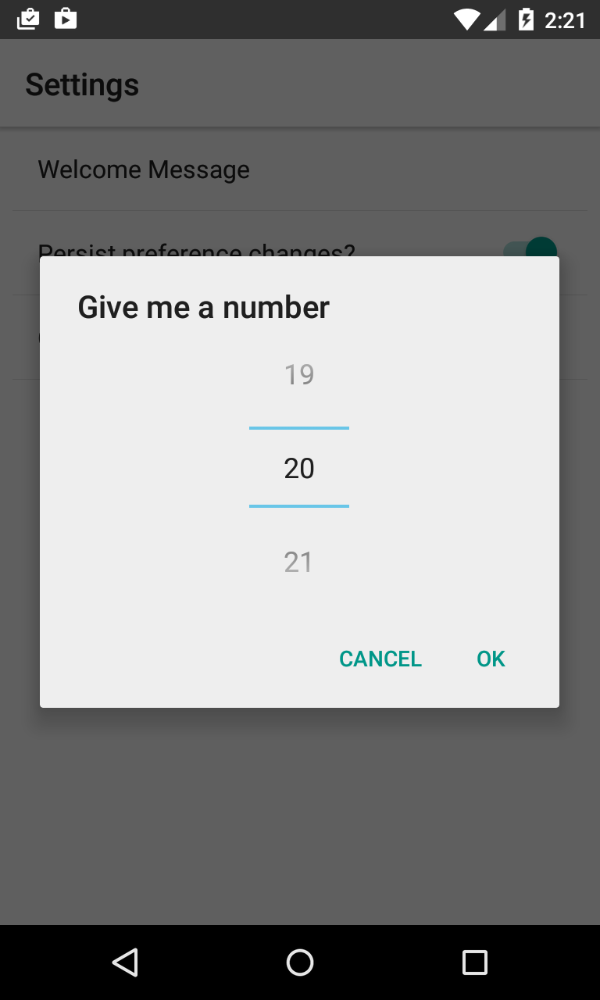

# AndroidPreferenceTest

A demo app for module `alobar-preference` with Android preference widget `NumberPickerPreference`.

This Gradle project is for the demo app which contains a separate module for the NumberPicker. Clone this repo and build the project to see how it works. Copy module `alobar-preference` to your own projects to use the widget implement there.

